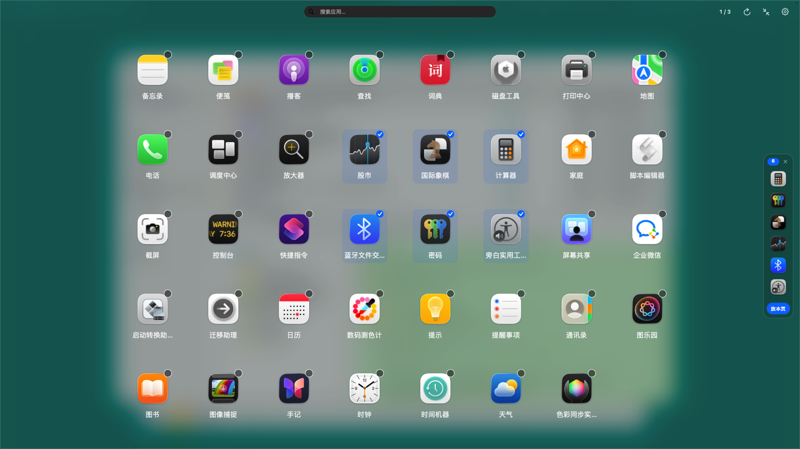
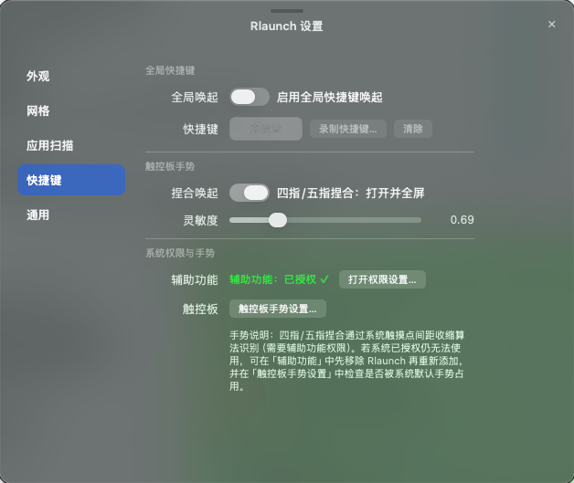

# Rlaunch

macOS 26 起系统移除了 Launchpad，Rlaunch 是其轻量优雅的 AppKit 原生平替：无边框圆角窗口、动态模糊背景、网格吸附分页、多维文件夹归类、批量多选中转站与全局快捷唤起，兼顾流畅交互与低资源占用。

# 效果图




## 核心功能

### 1. 窗口与网格
- **无边框质感窗口**：圆角与柔和阴影，窗口化模式下长按顶栏空白处可自由拖动；支持一键全屏/退出全屏。
- **吸附分页网格**：应用与文件夹按网格对齐，横向滑动松手自动吸附整页；全屏时图标、文字与间距自适应缩放铺满。
- **独立页面管理**：支持页面空间留白，跨页移走后不破坏原页面布局，空页面自动智能回收。
- **顶栏集成**：原生手感自绘三色按钮（关闭/最小化/全屏）、实时模糊搜索框、页码点击翻页、重新扫描与设置入口。

### 2. 文件夹系统
- **动态预览图标**：文件夹卡片直观显示内部应用缩略图；内部应用超出槽位时，末尾以多层叠放样式呈现并标注重叠数量。
- **自定义网格尺寸**：右键文件夹可自由调整尺寸（1×1、2×2、2×3 等），占用多格并自适应网格流式排布。
- **轻量展开弹窗**：点击展开居中半透明卡片（首屏置顶最上层应用），支持就地重命名标题、快捷解散文件夹、单个应用右键移出。
- **解散与释放**：解散文件夹时，其内部应用按序释放回当前页及后续页，自动顺延排布。
- **防嵌套与拖入动效**：严格禁止文件夹嵌套；将应用拖至文件夹上方时触发弹性微缩放与光晕高亮，松手即入。

### 3. 多选、中转站与拖拽重排
- **长按多选**：长按任意 App 或文件夹进入多选模式（右上角显示选择徽章），上限 10 项（超额 Toast 提醒并置灰不可选条目）。
- **右侧悬浮中转站**：
  - 选中条目自动入站，悬停可快捷单个移除；
  - 选中 ≥2 个 App 时可一键「建文件夹」；
  - 支持一键「放本页」或打开文件夹后「放文件夹」。
- **批量拖拽排序**：长按多选后拖动，严格**按照选中的先后时间顺序**一次性插入目标位置，附带 Retina 2x 高清拖拽预览图与计数胶囊角标。
- **互斥防护**：文件夹与其内部包含的应用自动互斥选中，避免逻辑冲突。

### 4. 外观与主题
- **深浅模式自适应**：全面适配浅色（Light）、深黑（Dark）与跟随系统；文件夹卡片与展开弹窗采用高通透高光与高饱和背景，避免界面穿透交叠。
- **背景与毛玻璃**：支持自定义背景图片、透明度（15%~100%）与高斯模糊（0~60）。

---

## 唤起说明

- **全局快捷键**：设置 →「快捷键」→「录制快捷键…」，采用系统 Carbon 热键接口，无需辅助功能权限。
- **四指 / 五指捏合**：触控板四指/五指间距向内捏合收缩触发：不在前台时唤起并全屏，已在前台时收起。需要「辅助功能权限」（设置中提供快捷授权检测与跳转）。
- **菜单栏图标**：常驻顶部菜单栏，支持快捷显示/隐藏、偏好设置与退出。
- **启动后自动收起**：点击运行 App 后自动隐藏窗口（可通过配置项 `hideOnLaunch` 开启/关闭）。

---

## 构建与运行

```bash
# Release 构建（输出 Rlaunch.app）
./build.sh

# Debug 构建
./build.sh debug

# 运行自动化测试套件（无 XCTest 依赖，覆盖搜索、配置、文件夹解散/排序/去重等）
swift run --package-path . --disable-sandbox RlaunchSelfTest
```

启动运行：`open Rlaunch.app`。应用为菜单栏驻留型（LSUIElement，无 Dock 图标）。

---

## 配置文件

配置文件路径：`~/Library/Application Support/Rlaunch/config.json`
包含了扫描目录列表、扫描递归层级、主题、背景样式、网格布局行列数、快捷键键值、捏合灵敏度开关、自定义页面排序（`pageOrders`）与文件夹信息。

---

## 项目结构

```
Sources/RlaunchCore/       核心数据层：模型定义、配置持久化、App 扫描器、图标缓存、主题与模糊搜索算法
Sources/Rlaunch/           AppKit 交互层：主窗口控制器、顶栏、吸附滚动容器、网格页面、条目组件、文件夹弹窗、中转站
Sources/RlaunchSelfTest/   单元自测：涵盖扫描去重、配置往返迁移、文件夹装箱/移动/解散、多选互斥等测试断言
```
