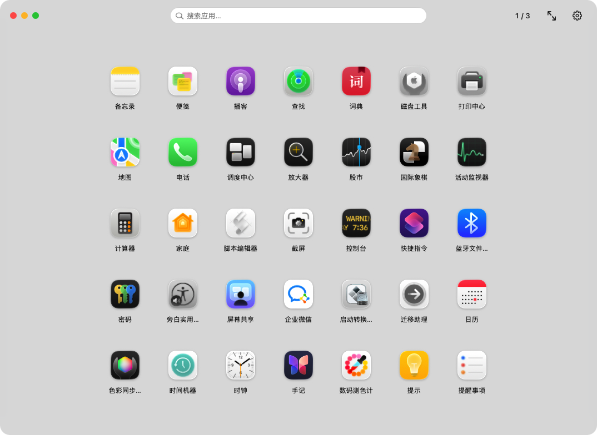

# Rlaunch

macOS 26 起系统移除了 Launchpad，Rlaunch 是它的 AppKit 平替：无边框圆角窗口、模糊/图片背景、网格分页、吸附滚动、文件夹归类、搜索、设置齐全，注重 CPU 与内存占用平衡。

# 效果图


## 功能

- **无边框窗口**：圆角 + 阴影；可缩放、可全屏（顶栏绿点或右上角全屏按钮），无系统标题栏
- **顶栏**（同一行）：
  - 左侧：自绘三色按钮（红=隐藏、黄=最小化、绿=全屏），鼠标悬停时显示对应符号（× / − / ⤢），与 macOS 原生红绿灯一致
  - 居中：实时模糊搜索（大小写不敏感子串 + 编辑距离容错 + 首字母缩写）
  - 右侧：页码（点击左右翻页）、全屏/退出、设置
- **应用网格**：高清图标 + 名称居中；一页放不下时左右滑动切换，松手自动吸附整页；支持方向键/PageUp/Down/Home/End 翻页
- **设置面板**（顶栏齿轮）：
  - 主题：明亮 / 深黑 / 跟随系统
  - 背景：自定义图片、透明度（15%~100%）、高斯模糊（0~60）
  - 网格：列数 3-10、行数 3-8、间距、图标大小
  - 扫描目录：自定义目录列表 + 递归层级（默认 3 层）
  - 快捷键：全局快捷键唤起（一键录制/清除，系统热键接口、无需权限）；四指/五指捏合打开并全屏（含灵敏度）；辅助功能权限状态 + 权限/触控板设置快捷入口
- **文件夹**：右键空白 →「新建文件夹」；把应用拖到文件夹图标上放入；文件夹内把应用拖到空白 = 移出；右键文件夹可重命名/删除；右键应用可「移动到文件夹」
- **交互**：点空白处——设置打开时关闭设置；文件夹/搜索模式时回到主界面；**全屏时关闭界面**（并恢复窗口尺寸）
- **唤起**：全局快捷键（设置中录制）、四指/五指捏合（打开并全屏）、菜单栏图标（显示/隐藏、设置、退出）
- 启动应用后自动收起界面（可在配置 `hideOnLaunch` 调整）

## 性能设计（CPU / 内存平衡）

- 图标经 `NSCache` 缓存（LRU，上限 500），只加载一次
- 网格单元按页复用，滚动只移动不重建；背景模糊图仅在设置变化时后台重算一次（带代际防串扰）
- 滚动/模糊/毛玻璃交给系统 GPU 合成；无常驻定时器，手势监听为事件驱动
- 扫描在后台线程执行，主线程仅做一次重排

## 构建

```bash
./build.sh            # release 构建，输出 Rlaunch.app
./build.sh debug      # debug 构建
swift run --package-path . --disable-sandbox RlaunchSelfTest   # 自测（扫描器/搜索/配置）
```

> 本机 SPM 沙箱在受限 shell 环境不可用，构建需 `--disable-sandbox`（已写入 build.sh）。

启动：`open Rlaunch.app`（或双击）。应用为菜单栏驻留型（无 Dock 图标）。

## 唤起说明（快捷键与捏合，重要）

- **全局快捷键**：设置 →「快捷键」→ 点击「录制快捷键…」后按下组合键（至少包含 ⌘/⌥/⌃/⇧ 之一，Esc 取消、Delete 清除）。
  走 Carbon `RegisterEventHotKey` 系统热键接口，**无需任何权限**；若被其他应用占用会注册失败，换一个组合键即可。
- **四指/五指捏合**：捏合（手指间距收缩约 20%）时——窗口隐藏则**打开并全屏**，已显示则收起。
  通过全局手势事件（gestureStarted/Ended）携带的触点位置计算间距收缩识别，需要**辅助功能权限**：
  设置 →「快捷键」页显示权限状态，可直接点「打开权限设置…」授权（开启捏合开关时也会自动弹系统授权窗）。
  > macOS 26 不再把 magnify 缩放事件转发给第三方应用，因此使用「四指间距收缩」判定捏合；
  > 手指数按事件触点统计，仅四指/五指触发。
- 系统若把四指/五指捏合保留为其它手势，可在设置中点击「触控板手势设置…」调整，或改用全局快捷键唤起。

## 配置

JSON 存于 `~/Library/Application Support/Rlaunch/config.json`：
扫描目录、递归层级、主题、背景图片/透明度/模糊、网格行列/间距/图标大小、
快捷键（`hotKeyEnabled`/`hotKeyKeyCode`/`hotKeyModifiers`）与捏合开关/灵敏度（`pinchEnabled`/`pinchThreshold`）、
文件夹结构、窗口尺寸。旧版 `gestureEnabled`/`gestureThreshold` 字段在读取时自动迁移为捏合字段。

## 已知限制

- 无 Dock 图标（LSUIElement），退出请用菜单栏图标
- 捏合监听依赖辅助功能权限与系统触点数据上报（见上文）
- ad-hoc 签名，首次运行如被 Gatekeeper 拦截：`右键 → 打开`

## 项目结构

```
Sources/RlaunchCore/   核心引擎：配置模型/存储、App 扫描、图标缓存、主题、模糊搜索
Sources/Rlaunch/       AppKit 界面：主窗口、顶栏、吸附滚动、网格、设置面板、快捷键/捏合监听、菜单栏
Sources/RlaunchSelfTest/  无 XCTest 依赖的自测入口（CLT 环境无 XCTest）
```
